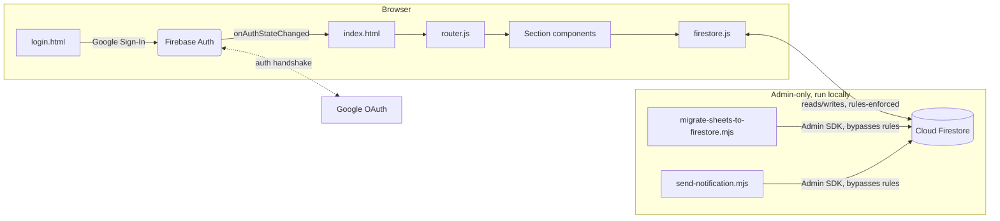

<div align="center">

# 🪜 CodeLadderr

**A fast, zero-cost DSA practice tracker**

Track your progress across 7 curated DSA sheets, keep daily/long-term goals,
build a GitHub-style contribution streak, and never lose your notes on a
problem again.

[](https://laddercode.netlify.app)
[](LICENSE)
[](#tech-stack)
[](#tech-stack)
[](#deployment)
[](#contributing)

[Live Demo](https://laddercode.netlify.app) · [Report Bug](../../issues) · [Request Feature](../../issues)

</div>

---

## Table of Contents

- [Why CodeLadderr](#why-codeladderr)
- [Features](#features)
- [Tech Stack](#tech-stack)
- [Architecture](#architecture)
- [Project Structure](#project-structure)
- [Data Model](#data-model)
- [Getting Started](#getting-started)
  - [Prerequisites](#prerequisites)
  - [Firebase Project Setup](#firebase-project-setup)
  - [Local Development](#local-development)
- [Data Migration](#data-migration)
- [Deployment](#deployment)
  - [Netlify](#netlify)
  - [Deploying Firestore Rules](#deploying-firestore-rules)
- [Broadcasting Notifications](#broadcasting-notifications)
- [Security](#security)
- [Post-Deploy Sanity Check](#post-deploy-sanity-check)
- [Roadmap](#roadmap)
- [Contributing](#contributing)
- [FAQ](#faq)
- [License](#license)

---

## Why CodeLadderr

Most DSA trackers are either a spreadsheet you abandon in a week, or a SaaS
product with a login wall and a price tag. CodeLadderr is neither:

- **$0 to run**, forever — Firebase Spark  + Netlify.
- **Your data, your Firestore project** — self-hosted, not a shared backend.

## Features

- 🔐 **Google Sign-In** via Firebase Auth — no passwords to manage.
- 📊 **Dashboard** — daily & long-term goals, per-sheet progress rings split
  by Easy/Medium/Hard, and a GitHub-style contribution heatmap.
- 📚 **7 curated sheets** — DSA Patterns, A2Z, Blind 75, Master DSA,
  RisingBrain (+ Last 100), AlgoMaster — with per-pattern grouping, search,
  and difficulty filters.
- 📝 **Per-problem notes** — approach, pattern, companies asked, your
  solution, and an optimized solution, all saved per question.
- 🔁 **Revision queue & Learning log** — auto-populated from whatever you've
  annotated, so nothing you've worked on gets lost.
- 🗺️ **Concept roadmap** — track core CS topics from "yet to learn" to
  "learned."
- 🔔 **Live notifications** — realtime, no polling.
- 🔍 **Global search** — jump to a section or a specific problem instantly.
- 🌗 **Dark / light theme**, persisted per-user and cached locally for
  instant paint.
- 🗑️ **Full account deletion** — one click wipes every trace of your data
  from Firestore and Auth.

## Tech Stack

| Layer | Choice | Why |
|---|---|---|
| UI | Vanilla JS (ES Modules) | Zero build step, zero framework lock-in, loads instantly |
| Auth | Firebase Authentication (Google provider) | No password storage, no email-verification flow to build |
| Database | Cloud Firestore | Realtime listeners, generous free tier, rules-based security |
| Hosting | Netlify | Free tier, git-based deploys, edge redirects |
| Styling | Plain CSS + custom properties (design tokens) | No CSS framework overhead, full control over theming |


## Architecture



Every read/write from the browser goes through `firestore.js` and is
enforced by `firestore.rules` — the client never has elevated access. The
two Admin SDK scripts are the only code paths with unrestricted access, and
neither ships to the browser.

## Project Structure

```
codeladderr/
├── public/                    # Real HTML entry points + static assets
│   ├── index.html             # Signed-in app shell
│   ├── login.html             # Sign-in page
│   ├── robots.txt
│   └── assets/{logos,icons}/
├── src/
│   ├── main.js                 # App bootstrap — auth gate, theme, idle timeout
│   ├── firebase/                # Auth + Firestore wrappers (the only files
│   │                             # that import the Firebase SDK directly)
│   ├── router/router.js         # Hash-based router + shell mounting
│   ├── state/store.js           # Tiny pub/sub store
│   ├── utils/                   # Dates, difficulty colors, contributions, idle timeout
│   ├── data/sheet-metadata.js   # Static sheet/section registry
│   ├── styles/                  # Design tokens + base styles + themes
│   └── components/
│       ├── shell/                # Topbar, sidebar, footer, search, notifications
│       ├── dashboard/             # Goals, progress rings, heatmap
│       ├── practice/              # Sheet browsing, problem rows, notes editor
│       ├── notes/, roadmap/, concepts/, learning/, revision/
│       └── settings/              # Account details, delete account
├── scripts/
│   ├── migrate-sheets-to-firestore.mjs   # One-time, Admin SDK, run locally
│   └── send-notification.mjs             # Broadcast a notification, Admin SDK
├── firestore/
│   ├── firestore.rules
│   └── firestore.indexes.json
├── netlify.toml
├── .env.example
└── README.md
```

## Data Model

```
users/{uid}
  displayName, email, photoURL, joinedAt, theme, streak, lastActiveDate

users/{uid}/dailyGoals/{dateId}          # "YYYY-MM-DD"
users/{uid}/longTermGoals/{goalId}
users/{uid}/progress/{sheetId}           # { ticked: { [questionId]: true } }
users/{uid}/questionData/{questionId}    # notes, approach, revision, etc.
users/{uid}/contributions/{dateId}       # { count }
users/{uid}/concepts/{conceptId}

notifications/{id}                       # admin-written, all users read

sheets/{sheetId}/patterns/{patternId}/problems/{problemId}   # read-only
```

Every subcollection under `users/{uid}` is readable/writable only by that
user — enforced in `firestore.rules`, not just in application code.

## Getting Started

### Prerequisites

- Node.js 18+ (only needed for the two local Admin SDK scripts, not for
  running the app itself)
- A free [Firebase](https://console.firebase.google.com) account
- The [Firebase CLI](https://firebase.google.com/docs/cli): `npm install -g firebase-tools`

### Firebase Project Setup

1. Create a project at [console.firebase.google.com](https://console.firebase.google.com).
2. **Authentication** → Sign-in method → enable **Google**.
3. **Firestore Database** → Create database → production mode.
4. **Project settings** → **General** → add a **Web app** → copy the config
   object.
5. Paste those values into `src/firebase/firebase-config.js`:
   ```js
   export const firebaseConfig = {
     apiKey: "...",
     authDomain: "...",
     projectId: "...",
     storageBucket: "...",
     messagingSenderId: "...",
     appId: "...",
   };
   ```
   > This file is committed with real values. A Firebase **web app config is
   > not a secret** — it identifies which project to talk to, nothing more.
   > Actual protection comes from Firestore Security Rules, Firebase Auth,
   > and the API key's HTTP-referrer restriction (step 7 below). Never
   > commit an Admin SDK **service account key** — that one is a real
   > credential; see [Security](#security).

6. Deploy the security rules:
   ```bash
   firebase login
   firebase use <your-project-id>
   firebase deploy --only firestore:rules
   ```
   Before deploying, replace `<HARDCODED_ADMIN_UID>` in
   `firestore/firestore.rules` with your own Firebase Auth UID (found in
   Authentication → Users after your first sign-in).
7. Restrict the auto-created browser API key to your domain(s):
   Google Cloud Console → APIs & Services → Credentials → the Firebase
   browser key → Application restrictions → HTTP referrers → add
   `localhost/*` and your deployed domain.

### Local Development

No build step, no dev server framework — any static file server works:

```bash
git clone https://github.com/<you>/codeladderr.git
cd codeladderr
npx serve .
```

Then visit `http://localhost:<port>/public/login.html`. Add `localhost` to
Firebase Auth's **Authorized domains** if it isn't already there by default
(it usually is).

## Data Migration

Problem data is seeded once via the Firebase Admin SDK — never from the
browser:

```bash
npm install firebase-admin
export GOOGLE_APPLICATION_CREDENTIALS="/path/to/service-account.json"
node scripts/migrate-sheets-to-firestore.mjs
```

## Deployment

### Netlify

This repo publishes straight from the repo root — `netlify.toml` handles
the redirects:

1. [app.netlify.com](https://app.netlify.com) → **Add new site** → import
   this repo.
2. Build settings: leave **build command blank**, **publish directory = `.`**
   (already set in `netlify.toml`).
3. Deploy.
4. Add the resulting `*.netlify.app` domain (and any custom domain) to
   Firebase Auth's **Authorized domains**.
5. Add the same domain to the API key's HTTP-referrer restrictions (see
   step 7 above).

### Deploying Firestore Rules

**Netlify does not deploy Firestore rules.** Any time `firestore.rules`
changes, redeploy it separately:

```bash
firebase deploy --only firestore:rules
```

## Broadcasting Notifications

```bash
node scripts/send-notification.mjs --title "New sheet added" --body "AlgoMaster is now live!"
```

Every signed-in user sees it appear live in the notifications dropdown —
no redeploy required.

## Security

| Layer | What it does |
|---|---|
| Firestore Rules | Every user's data is scoped to `request.auth.uid == uid`; `sheets/*` is auth-read-only; `notifications/*` writes require the hardcoded admin UID |
| Firebase Auth | Google OAuth only — no password storage |
| API key restriction | The public Firebase config's API key only works from allowlisted domains |
| Admin SDK scripts | Never shipped to the client; require a service account key that must **never** be committed |

**If you ever commit a service account key by mistake:** rotating it (delete
+ regenerate in Firebase Console → Project settings → Service accounts) is
non-negotiable — removing the file from a future commit does not remove it
from git history.


## Roadmap

- [ ] Problem-of-the-day suggestion
- [ ] Export progress as PDF/CSV
- [ ] Multi-language code snippet storage per question
- [ ] Public read-only profile pages
- [ ] PWA / offline support

## Contributing

Contributions are welcome. Please:

1. Fork the repo and create a branch: `git checkout -b feat/your-feature`
2. Follow the existing folder structure — one `.css` file per component,
   using tokens from `src/styles/tokens.css` (never hardcode a color that's
   already a token).
3. No `console.log` left in committed code.
4. Open a PR with a clear description of what changed and why.

## FAQ

**Is my data private?**
Yes — every read/write is scoped to your own UID by Firestore rules, not
just by application-level checks.

**Can I self-host this with my own Firebase project?**
Yes, that's the intended usage — see [Getting Started](#getting-started).

## License

Distributed under the MIT License. See [`LICENSE`](LICENSE) for details.

---

<div align="center">

Built with ☕ and a genuine grudge against subscription-based todo apps.

</div>
